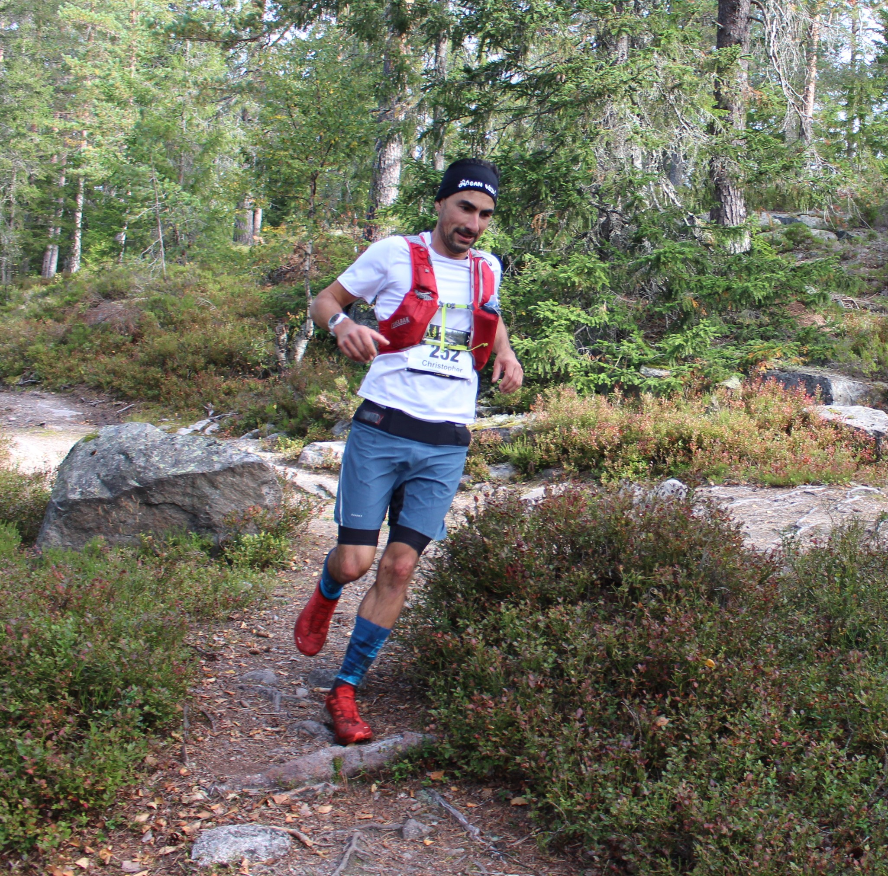

# About

This is the personal blog post of [Christopher Coello](https://www.linkedin.com/in/chrcoello/), a data shepherd with multiple working experiences in the last 10 years:
 + from [Norsvin](https://norsvin.no/about-us/), world leader in swine genetics,
 + from [Hagal](https://www.hagal.no), scale-up developing intelligent batteries,
 + from the Norwegian distribution system operator [Elvia](www.elvia.no),
 + from [Refinitiv](https://www.refinitiv.com/en/products/eikon-trading-software/commodity-trading), world leader providing analytics for energy traders,
 + from [Imanova](https://invicro.com/about/) (now Invicro), leaders in imaging for drug development.
 
This blog is here to present a selection of interesting topics in the realm of data science / machine learning, applied to different use-cases.    
On a personal level, I live in a farm with my family outside Hamar, Norway. I am an eager ultra trail runner, the sport of running long distances in the mountains.  

 

