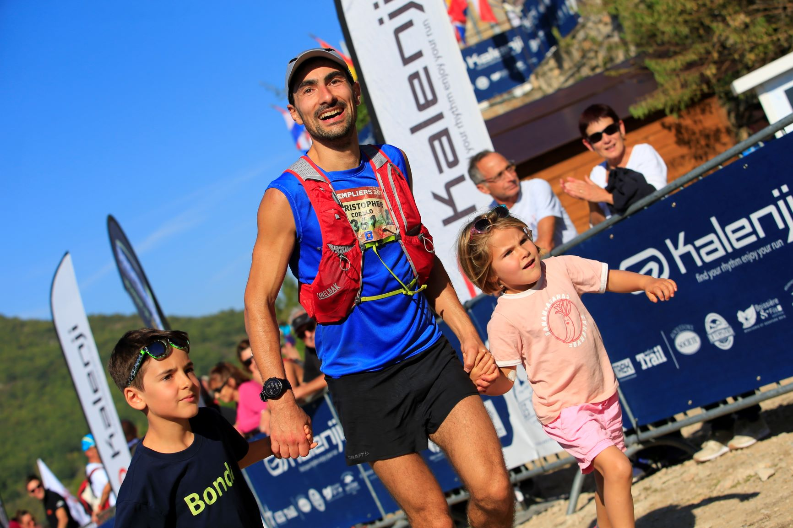

# About

This is the personal blog post of [Christopher Coello](https://www.linkedin.com/in/chrcoello/), a data scientist at the Norwegian distribution system operator [Elvia](www.elvia.no). This blog is here to present some of the work that is done in the realm of data science applied to grid related use cases.  
On the side of Elvia, I work part-time (20%) at the [Machine Learning Group](https://machine-learning.uit.no/) in Tromsø and help the Energy Analytics team lead by [Stian Anfinsen](https://machine-learning.uit.no/people#h.p_A-d3X8dUCKER) with industrial applications to the excellent ML work done there.  
On a personal level, I live in a farm with my family outside Hamar, Norway. I am an eager ultra trail runner, the sport of running long distances in the mountains.  

 

